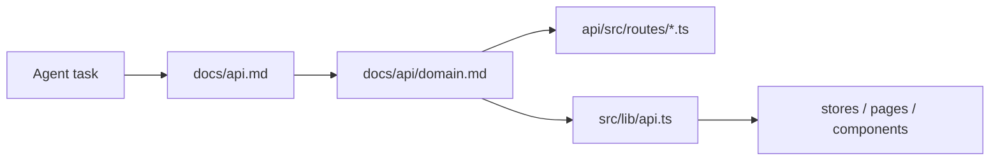
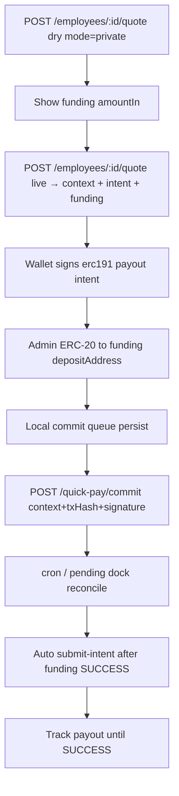
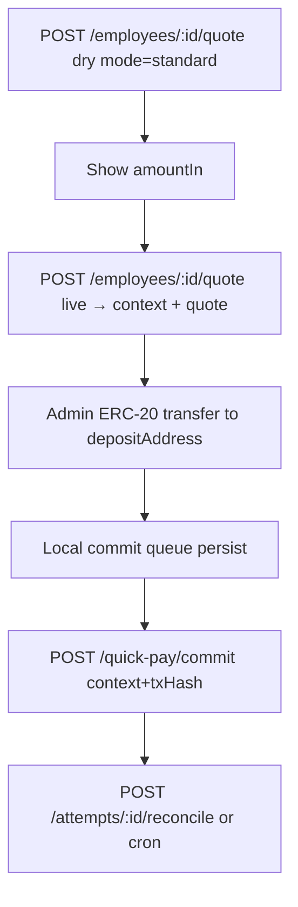
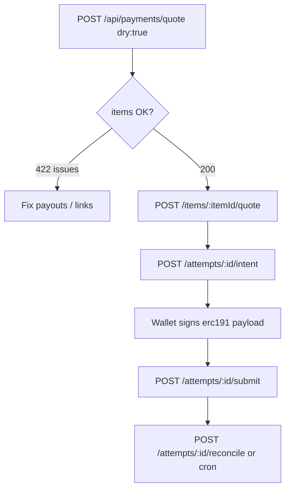

# DECash / SalaryFlow API Reference (Agent-first)

Source of truth for HTTP contracts used by page migration, client wiring, and debugging.
Backend handlers win over frontend types when they diverge.

## How to use this doc

1. Find `Method` + `Path` in the [Master index](#master-index).
2. Open the linked domain file under `docs/api/`.
3. Follow **Source** (handler) and **Client** (`src/lib/api.ts`) when integrating or changing behavior.
4. On failure, match `error.code` / HTTP status in [Error code index](#error-code-index) or [Debug cheatsheet](#debug-cheatsheet).

## Runtime

| Item | Value |
|---|---|
| Framework | Hono on Cloudflare Workers |
| Entry | [`api/src/index.ts`](../api/src/index.ts) |
| Local | `wrangler dev --port 8787` → `http://127.0.0.1:8787` |
| Production API | `https://salary.stableflow.ai/api` ([`api/wrangler.toml`](../api/wrangler.toml)) |
| Frontend calls | same-origin `/api…` via [`src/lib/api.ts`](../src/lib/api.ts) |
| Dev proxy | Vite `/api` → `VITE_API_PROXY` or `http://127.0.0.1:8787` |
| OpenAPI | none |
| Cron | `* * * * *` — materialize payroll schedules + reconcile 1 open payment |

### Route mounts

| Prefix | Handler module |
|---|---|
| `GET /health` | [`api/src/index.ts`](../api/src/index.ts) |
| `/api/auth` | [`api/src/routes/auth.ts`](../api/src/routes/auth.ts) |
| `/api/invites` | [`api/src/routes/invites.ts`](../api/src/routes/invites.ts) |
| `/api/org` | [`api/src/routes/org.ts`](../api/src/routes/org.ts) |
| `/api/payroll` | [`api/src/routes/payroll.ts`](../api/src/routes/payroll.ts) |
| `/api/payments` | [`api/src/routes/payments.ts`](../api/src/routes/payments.ts) |
| `/api/records` | [`api/src/routes/records.ts`](../api/src/routes/records.ts) |

## Shared conventions

### Auth

- Cookie: `sf_token=<JWT>` (HttpOnly, SameSite=Lax, Max-Age=7d). Set by register/login/accept-invite.
- Or header: `Authorization: Bearer <JWT>` (supported by middleware; frontend does **not** send it).
- Frontend: `credentials: "same-origin"` only — cookie jar, no Bearer.
- Middleware: [`api/src/middleware.ts`](../api/src/middleware.ts)
  - `authMiddleware` — JWT only (`GET/PATCH /api/auth/me`)
  - `requireRole(...roles)` — JWT + load user + role check; `status=disabled` → 401

### CORS

Allowed origins: `APP_URL`, `http://127.0.0.1:5173`, `http://localhost:5173`. Credentials allowed. Headers: `Content-Type, Authorization`. `OPTIONS` → 204.

### Errors

Shape: `{ error: string, code?: string, ...extra }`.

| Status | When |
|---|---|
| 401 | Missing/invalid JWT, or user missing/disabled |
| 403 | Role mismatch / account disabled on login |
| 404 | `{ error: "Not found" }` global, or resource missing |
| 503 | Missing `JWT_SECRET` → `{ code: "SERVER_NOT_CONFIGURED" }` on all `/api/*` |

Frontend throws [`ApiError`](../src/lib/api.ts) with `status` + optional `code`. Extra fields (`issues`, `detail`, `attempt`) are **not** attached to `ApiError` — only `error`/`code` are parsed.

### Money / payout enums

- Amounts in API bodies are often decimal **strings** (`amount`); stored/returned as `amount_minor` (integer, **1e6** scale).
- Tokens: `USDC` \| `USDT` ([`api/src/payout.ts`](../api/src/payout.ts))
- Networks: `Base` \| `Arbitrum` \| `Polygon` \| `Optimism` \| `Ethereum` \| `BNB Chain`

### Two wallets (do not confuse)

| Wallet | Role | Endpoints | Stored on |
|---|---|---|---|
| **Admin payment wallet** | Pays payroll (signer) | `/api/records/wallet/*` | `users.wallet_address` / `wallet_verified_at` → `AuthUser.wallet_*` |
| **Employee payout wallet** | Receives salary | `/api/records/me/payout*` | `employees.endpoint` / `payout_verified_at` / `status` |

### Frontend consumption map

| Surface | Uses API? |
|---|---|
| [`src/lib/api.ts`](../src/lib/api.ts) | **Only** HTTP client — always wire new views through this |
| [`src/stores/auth.ts`](../src/stores/auth.ts), AppHeader / wallet dialogs | Live on current router |
| [`src/pages/**`](../src/pages), [`src/auth/AuthPages.tsx`](../src/auth/AuthPages.tsx), [`src/components/PayDialog.tsx`](../src/components/PayDialog.tsx), [`src/lib/payment.ts`](../src/lib/payment.ts) | Full business callers (legacy; not mounted in router) |
| [`src/views/**`](../src/views) | Mostly placeholders — **do not assume** they call APIs yet |

No shared types package. Frontend types in `api.ts` are a hand-maintained subset of Worker responses.

## Payment flow (summary)

### Quick Pay (current admin home)

**Private** (default — fully private). Live quote is **ephemeral** (HMAC `context` token, no DB rows until commit):

**Standard** (foreign-to-foreign + `confidentiality`):

Private payout uses `CONFIDENTIAL_INTENTS` with the selected `originAsset` as the confidential balance asset; funding deposits that same asset (`ORIGIN_CHAIN` → `CONFIDENTIAL_INTENTS`). Standard uses `ORIGIN_CHAIN` + `INTENTS_CONFIDENTIALITY` (default `advanced`). Cancelled wallet signatures/transfers leave **no** DB rows. After tx hash, the frontend persists a commit queue (`src/stores/quick-pay-commit-queue.ts`) and retries `POST /quick-pay/commit`. UI tracks in-flight attempts via `GET /payments/pending` + Pending Payments dock.

### Legacy payroll-run path (still available)

Details: [`docs/api/payments.md`](api/payments.md).

## Master index

| Method | Path | Auth | Domain | Handler | Client |
|---|---|---|---|---|---|
| GET | `/health` | public | — | `api/src/index.ts` | — |
| GET | `/api/auth/registration` | public | [auth](api/auth.md) | `api/src/routes/auth.ts` | `api.registrationConfig` |
| POST | `/api/auth/register` | public | [auth](api/auth.md) | `api/src/routes/auth.ts` | `api.register` |
| POST | `/api/auth/login` | public | [auth](api/auth.md) | `api/src/routes/auth.ts` | `api.login` |
| POST | `/api/auth/logout` | public | [auth](api/auth.md) | `api/src/routes/auth.ts` | `api.logout` |
| GET | `/api/auth/me` | JWT | [auth](api/auth.md) | `api/src/routes/auth.ts` | `api.me` |
| PATCH | `/api/auth/me` | JWT | [auth](api/auth.md) | `api/src/routes/auth.ts` | `api.updateMe` |
| POST | `/api/auth/change-password` | JWT | [auth](api/auth.md) | `api/src/routes/auth.ts` | `api.changePassword` |
| GET | `/api/invites` | admin | [invites](api/invites.md) | `api/src/routes/invites.ts` | `api.listInvites` |
| POST | `/api/invites` | admin | [invites](api/invites.md) | `api/src/routes/invites.ts` | `api.createInvite` |
| GET | `/api/invites/resolve/:token` | public | [invites](api/invites.md) | `api/src/routes/invites.ts` | `api.resolveInvite` |
| POST | `/api/invites/accept` | public | [invites](api/invites.md) | `api/src/routes/invites.ts` | `api.acceptInvite` |
| POST | `/api/invites/:id/resend` | admin | [invites](api/invites.md) | `api/src/routes/invites.ts` | `api.resendInvite` |
| POST | `/api/invites/:id/revoke` | admin | [invites](api/invites.md) | `api/src/routes/invites.ts` | `api.revokeInvite` |
| GET | `/api/org/context` | admin\|employee | [org](api/org.md) | `api/src/routes/org.ts` | `api.orgContext` |
| GET | `/api/org` | admin | [org](api/org.md) | `api/src/routes/org.ts` | `api.org` |
| PATCH | `/api/org` | admin | [org](api/org.md) | `api/src/routes/org.ts` | `api.updateOrg` |
| PATCH | `/api/org/team` | admin | [org](api/org.md) | `api/src/routes/org.ts` | `api.updateTeam` |
| GET | `/api/org/employees` | admin | [org](api/org.md) | `api/src/routes/org.ts` | `api.listEmployees` |
| GET | `/api/org/employees/:id` | admin | [org](api/org.md) | `api/src/routes/org.ts` | `api.getEmployee` |
| GET | `/api/org/employees/:id/payments` | admin | [org](api/org.md) | `api/src/routes/org.ts` | `api.listEmployeePayments` |
| GET | `/api/org/pay-overview` | admin | [org](api/org.md) | `api/src/routes/org.ts` | `api.payOverview` |
| GET | `/api/org/overview` | admin | [org](api/org.md) | `api/src/routes/org.ts` | `api.orgOverview` |
| GET | `/api/org/payments` | admin | [org](api/org.md) | `api/src/routes/org.ts` | `api.listOrgPayments` |
| POST | `/api/org/employees` | admin | [org](api/org.md) | `api/src/routes/org.ts` | `api.createEmployee` |
| PATCH | `/api/org/employees/:id` | admin | [org](api/org.md) | `api/src/routes/org.ts` | `api.updateEmployee` |
| DELETE | `/api/org/employees/:id` | admin | [org](api/org.md) | `api/src/routes/org.ts` | `api.deleteEmployee` |
| GET | `/api/payroll` | admin | [payroll](api/payroll.md) | `api/src/routes/payroll.ts` | `api.listRuns` |
| POST | `/api/payroll` | admin | [payroll](api/payroll.md) | `api/src/routes/payroll.ts` | `api.createRun` |
| GET | `/api/payroll/schedules` | admin | [payroll](api/payroll.md) | `api/src/routes/payroll.ts` | `api.listPayrollSchedules` |
| PATCH | `/api/payroll/schedules/:id` | admin | [payroll](api/payroll.md) | `api/src/routes/payroll.ts` | `api.updatePayrollSchedule` |
| DELETE | `/api/payroll/schedules/:id` | admin | [payroll](api/payroll.md) | `api/src/routes/payroll.ts` | `api.archivePayrollSchedule` |
| GET | `/api/payroll/:id` | admin | [payroll](api/payroll.md) | `api/src/routes/payroll.ts` | `api.getRun` |
| POST | `/api/payroll/:id/items/import` | admin | [payroll](api/payroll.md) | `api/src/routes/payroll.ts` | `api.importPayrollItems` |
| POST | `/api/payroll/:id/items` | admin | [payroll](api/payroll.md) | `api/src/routes/payroll.ts` | `api.addItem` |
| PATCH | `/api/payroll/:id/items/:itemId` | admin | [payroll](api/payroll.md) | `api/src/routes/payroll.ts` | `api.updatePayrollItem` |
| DELETE | `/api/payroll/:id/items/:itemId` | admin | [payroll](api/payroll.md) | `api/src/routes/payroll.ts` | `api.removePayrollItem` |
| PATCH | `/api/payroll/:id` | admin | [payroll](api/payroll.md) | `api/src/routes/payroll.ts` | `api.updateRun` / `api.setRunStatus` |
| DELETE | `/api/payroll/:id` | admin | [payroll](api/payroll.md) | `api/src/routes/payroll.ts` | `api.archiveRun` |
| POST | `/api/payments/quote` | admin | [payments](api/payments.md) | `api/src/routes/payments.ts` | `api.quote` |
| POST | `/api/payments/items/:itemId/quote` | admin | [payments](api/payments.md) | `api/src/routes/payments.ts` | `api.quotePaymentItem` |
| POST | `/api/payments/quick-pay/quote` | admin | [payments](api/payments.md) | `api/src/routes/payments.ts` | `api.quoteQuickPay` / `quoteQuickPayDry` |
| POST | `/api/payments/employees/:employeeId/quote` | admin | [payments](api/payments.md) | `api/src/routes/payments.ts` | `api.quoteEmployeePayment` / `quoteEmployeePaymentDry` |
| POST | `/api/payments/quick-pay/commit` | admin | [payments](api/payments.md) | `api/src/routes/payments.ts` | `api.commitQuickPay` |
| POST | `/api/payments/attempts/:attemptId/intent` | admin | [payments](api/payments.md) | `api/src/routes/payments.ts` | `api.generatePaymentIntent` |
| POST | `/api/payments/attempts/:attemptId/submit` | admin | [payments](api/payments.md) | `api/src/routes/payments.ts` | `api.submitPaymentAttempt` |
| POST | `/api/payments/attempts/:attemptId/reconcile` | admin | [payments](api/payments.md) | `api/src/routes/payments.ts` | `api.reconcilePaymentAttempt` |
| GET | `/api/payments/pending` | admin | [payments](api/payments.md) | `api/src/routes/payments.ts` | `api.listPendingPayments` |
| POST | `/api/payments/reconcile` | admin | [payments](api/payments.md) | `api/src/routes/payments.ts` | `api.reconcileOpenPayments` |
| POST | `/api/payments/runs/:runId/reopen-failed` | admin | [payments](api/payments.md) | `api/src/routes/payments.ts` | `api.reopenFailedPayments` |
| GET | `/api/payments/runs/:runId/attempts` | admin | [payments](api/payments.md) | `api/src/routes/payments.ts` | `api.listPaymentAttempts` |
| POST | `/api/payments/generate-intent` | admin | [payments](api/payments.md) | `api/src/routes/payments.ts` | — **deprecated** |
| POST | `/api/payments/submit-intent` | admin | [payments](api/payments.md) | `api/src/routes/payments.ts` | — **deprecated** |
| POST | `/api/payments/status` | admin | [payments](api/payments.md) | `api/src/routes/payments.ts` | — **deprecated** |
| GET | `/api/records` | admin | [records](api/records.md) | `api/src/routes/records.ts` | `api.listRecords` |
| GET | `/api/records/me` | employee | [records](api/records.md) | `api/src/routes/records.ts` | `api.myRecords` |
| GET | `/api/records/me/payout` | employee | [records](api/records.md) | `api/src/routes/records.ts` | `api.myPayout` |
| PATCH | `/api/records/me/profile` | employee | [records](api/records.md) | `api/src/routes/records.ts` | `api.updateMyProfile` |
| PUT | `/api/records/me/payout` | employee | [records](api/records.md) | `api/src/routes/records.ts` | `api.updatePayout` |
| POST | `/api/records/me/payout/challenge` | employee | [records](api/records.md) | `api/src/routes/records.ts` | `api.createPayoutChallenge` |
| POST | `/api/records/me/payout/verify` | employee | [records](api/records.md) | `api/src/routes/records.ts` | `api.verifyPayout` |
| POST | `/api/records/consents` | employee | [records](api/records.md) | `api/src/routes/records.ts` | `api.signConsent` |
| GET | `/api/records/consents/me` | employee | [records](api/records.md) | `api/src/routes/records.ts` | `api.myConsent` |
| POST | `/api/records/wallet/challenge` | admin | [records](api/records.md) | `api/src/routes/records.ts` | `api.createPaymentWalletChallenge` |
| POST | `/api/records/wallet/verify` | admin | [records](api/records.md) | `api/src/routes/records.ts` | `api.verifyPaymentWallet` |
| PUT | `/api/records/wallet` | admin | [records](api/records.md) | `api/src/routes/records.ts` | — always 409 |
| DELETE | `/api/records/wallet` | admin | [records](api/records.md) | `api/src/routes/records.ts` | `api.unbindWallet` |

## Error code index

| Code | Typical status | Domain | Meaning |
|---|---|---|---|
| `SERVER_NOT_CONFIGURED` | 503 | global | Missing `JWT_SECRET` |
| `PASSWORD_HASH_UNAVAILABLE` | 503 | auth/invites | PBKDF2 failed |
| `INVITE_EMAIL_FAILED` | 503 | invites | Invite row may already exist; email send failed |
| `PAYROLL_IMPORT_INVALID` | 400 | payroll | CSV rows invalid; see `errors[]` |
| `PAYMENTS_DISABLED` | 503 | payments | `PAYMENTS_MODE` unset/disabled |
| `LIVE_PAYMENTS_DISABLED` | 409 | payments | Live path blocked or `dry !== true` on `/quote`; also deprecated routes |
| `DRY_RUN_VALIDATION_FAILED` | 422 | payments | See `issues[]` (item-level codes below) |
| `INVALID_PROVIDER_URL` | 503 | payments | Bad / non-official `INTENTS_API_URL` |
| `LIVE_ACK_REQUIRED` | 503 | payments | Missing `PAYMENTS_EXECUTION_ACK` |
| `PAYMENT_PROVIDER_NOT_CONFIGURED` | 503 | payments | Missing `INTENTS_API_KEY` |
| `PAYMENT_WALLET_NOT_VERIFIED` | 422 | payments | Admin wallet not bound/verified |
| `PAYMENT_WALLET_INVALID` | 422 | payments | Signer not valid EVM address |
| `PAYMENT_WALLET_CHANGED` | 409 | payments | Current wallet ≠ attempt `signer_id` |
| `IDEMPOTENCY_KEY_CONFLICT` | 409 | payments | Key reused on different item |
| `ITEM_NOT_PENDING` | 409 | payments | Item not pending/failed |
| `ACTIVE_ATTEMPT_EXISTS` | 409 | payments | Item already has active attempt |
| `ASSET_MAP_MISSING` | 503 | payments | No `INTENTS_ASSET_MAP` entry |
| `ASSET_MAP_PROVIDER_MISMATCH` | 503 | payments | Map vs provider tokens mismatch |
| `AMOUNT_PRECISION_UNSUPPORTED` | 422 | payments | Amount vs destination decimals |
| `PAYMENT_PROVIDER_ERROR` | 503 | payments | 1Click quote/intent failure; may include `detail` |
| `QUOTE_EXPIRED` | 409 | payments | Need new attempt |
| `ATTEMPT_STATE_CONFLICT` | 409 | payments | Concurrent state transition |
| `PAYMENT_SUBMIT_REJECTED` | 409 | payments | Definitive reject; item reopened |
| `ACTIVE_PAYMENT_ATTEMPTS` | 409 | records | Cannot change/remove admin wallet |
| `WALLET_SIGNATURE_REQUIRED` | 409 | records | `PUT /wallet` forbidden; use challenge/verify |

### Dry-run / payable item issue codes (`issues[].code`)

`UNLINKED_EMPLOYEE` · `PAYOUT_NOT_READY` · `PAYOUT_NOT_VERIFIED` · `INVALID_PAYOUT_ADDRESS` · `PAYOUT_DETAILS_CHANGED` · `UNSUPPORTED_TOKEN` · `UNSUPPORTED_NETWORK` · `INVALID_AMOUNT`

## Debug cheatsheet

| Symptom | Check |
|---|---|
| All `/api/*` → 503 `SERVER_NOT_CONFIGURED` | `JWT_SECRET` in Worker secrets / `.dev.vars` |
| 401 on every authed call | Cookie not sent (proxy/host mismatch); use same-origin `/api` or Bearer |
| Login 403 | User `status=disabled` |
| Invite 503 `INVITE_EMAIL_FAILED` | Invite may exist; fix Resend/`MOCK_EMAIL=true` then resend |
| Cannot edit payroll items | Run must be `draft`; item `pending` with no attempts |
| Dry-run 422 | Employee not linked / payout not `ready` / token-network mismatch |
| Live quote 409 `LIVE_PAYMENTS_DISABLED` | `PAYMENTS_MODE=live`, official provider URL, `PAYMENTS_EXECUTION_ACK` |
| Live quote 422 `PAYMENT_WALLET_NOT_VERIFIED` | Admin must complete `/records/wallet/challenge` + `verify` |
| Intent 409 `PAYMENT_WALLET_CHANGED` | Re-verify wallet that matches attempt `signer_id` |
| Submit 202 `outcome: unknown` | Schedule reconcile; do not treat as hard failure |
| Views show no data | New `src/views/**` often placeholders — wire via `api.*` + react-query |

## Env vars (behavior)

| Var | Effect |
|---|---|
| `JWT_SECRET` | Required for `/api/*` |
| `APP_URL` | CORS, invite links, cookie Secure |
| `API_URL` | Documented production base |
| `COOKIE_DOMAIN` | Optional cookie Domain |
| `RESEND_API_KEY` / `SENDER_EMAIL` | Invite email |
| `MOCK_EMAIL=true` | Skip real email; response may include `inviteUrl` |
| `INTENTS_API_URL` | 1Click origin (live requires official/loopback) |
| `INTENTS_API_KEY` | Live payments |
| `INTENTS_ASSET_MAP` | Required for **legacy payroll-run** quotes only. Private Quick Pay uses the selected `originAsset` as the confidential balance asset; standard Quick Pay resolves assets from `/v0/tokens` |
| `INTENTS_CONFIDENTIALITY` | `public` \| `basic` \| `advanced` (default `advanced`) for **standard** ORIGIN_CHAIN Quick Pay quotes |
| `INTENTS_QUOTE_PUBLIC_KEY` | Optional quote verify override |
| `PAYMENTS_MODE` | `disabled` \| `dry-run` \| `live` |
| `PAYMENTS_EXECUTION_ACK` | `local-test` \| `mainnet-live` |

## Domain docs

- [auth](api/auth.md)
- [invites](api/invites.md)
- [org](api/org.md)
- [payroll](api/payroll.md)
- [payments](api/payments.md)
- [records](api/records.md)
