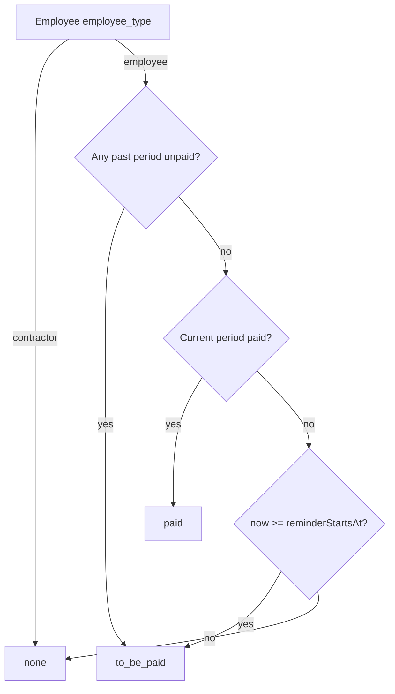

# Pay status: To be paid / Paid / none (Agent-first)

Source of truth for **employee pay-status badges** and **Pay overview aggregates** on the admin Pay page.
Agents implementing Recipients, High Priority, stats, or Quick Pay period keys must follow this doc and the backend helpers — do not invent client-side period math.

## Source of truth

| Layer | Location |
|---|---|
| Period + status helpers | [`api/src/pay-period.ts`](../api/src/pay-period.ts) — `resolveCurrentPeriod`, `enumeratePeriodsSince`, `computeEmployeePayStatus`, `isInReminderWindow` |
| Aggregates + `payStatuses` | [`GET /api/org/pay-overview`](api/org.md#get-apiorgpay-overview) in [`api/src/routes/org.ts`](../api/src/routes/org.ts) |
| Per-employee `payStatus` | [`GET /api/org/employees`](api/org.md#get-apiorgemployees) |
| Paid records | `employee_payments` (`period_key` + `status = 'paid'`) |
| Team schedule | `organizations.payment_cadence`, `payment_date_key`, `reminder_lead_days` (Create Team / `PATCH /api/org/team`) |

**Timezone:** all dates and reminder windows are **UTC**. Reminder window starts at payday − `reminder_lead_days` at **UTC 00:00**.

## Status enum

| Status | UI |
|---|---|
| `to_be_paid` | Show “To be paid” (purple payroll chip where applicable) |
| `paid` | Show “Paid” |
| `none` | Show nothing (no badge) |

Type: `EmployeePayStatus` in `api/src/pay-period.ts`.

## Phase-1 scope

- Stats and badges use the **team** schedule only for `employee_type = 'employee'`.
- **Contractors** return `none` until Recipients refactor adds per-recipient cadence (TODO).
- Periods count only from `employees.created_at` onward (no liability before hire/add).
- Missing / unset payment rows for a period key count as **unpaid**.

## Period and payday

### Monthly (`payment_cadence = monthly`)

`payment_date_key`:

| Key | Payday (UTC) |
|---|---|
| `every_1st` | 1st of month |
| `every_15th` | 15th of month |
| `every_end_of_month` | Last calendar day of month |

- `period_key` = `YYYY-MM` of that payday.
- **Current period:** payday on or after today in the current month; if today is **after** this month’s payday, roll to next month’s payday.

### Weekly (`payment_cadence = weekly`)

`payment_date_key`: `every_sunday` … `every_saturday`.

- Payday = next occurrence of that weekday on or after today (UTC).
- `period_key` = ISO week of that payday (`YYYY-Www`).

### Reminder window

- `reminderStartsAt` = `(payday − reminder_lead_days)` as `YYYY-MM-DDT00:00:00.000Z`.
- Defaults when configuring team (env): monthly **7**, weekly **3** (`REMINDER_LEAD_DAYS_MONTHLY` / `REMINDER_LEAD_DAYS_WEEKLY`).
- `inReminderWindow` ⇔ `now >= reminderStartsAt`.
- Pay page **Expired Date** = current period `payday` (`YYYY-MM-DD` UTC); display helpers: `formatPaydayDisplay`, `monthLabelForPayday`.

### Product examples

- Monthly, payday 15th, lead 7 → reminder from **9th 00:00 UTC**.
- Weekly, Friday payday, lead 3 → reminder from **Wednesday 00:00 UTC**.

## Algorithm (`computeEmployeePayStatus`)

Inputs:

1. `current` — `PeriodWindow` from `resolveCurrentPeriod`.
2. `periodKeysSinceJoin` — from `enumeratePeriodsSince(..., employee.created_at)` (payday on/after join day).
3. `paidByPeriod` — map `period_key → boolean` where `true` iff `employee_payments.status === 'paid'` for that employee.

```text
1. pastKeys = periodKeysSinceJoin excluding current.periodKey
2. If any pastKey is unpaid (missing or not paid) → to_be_paid   // arrears
3. Else if current period is paid → paid
4. Else if now >= current.reminderStartsAt → to_be_paid         // in reminder window
5. Else → none                                                    // before window, no arrears
```



### Implications for agents

- Before the reminder window, with no arrears and current unpaid → **no badge** (`none`), not “To be paid”.
- Any unpaid **past** period since join forces `to_be_paid` even outside the current reminder window.
- Quick Pay / `employee_payments.period_key` must use the same `resolveCurrentPeriod` key for the settle period.

## Pay overview aggregates

Endpoint: `GET /api/org/pay-overview` (admin). Counts **employees only**.

| Field | Rule |
|---|---|
| `stats.currentPayrollMinor` | Sum of `amount_minor` over employees |
| `stats.recipientsCount` | Employee count |
| `stats.toBePaidCount` | Count with `payStatus === 'to_be_paid'` |
| `stats.paidCount` | Count with `payStatus === 'paid'` |
| `stats.progress` | `round(paidCount / max(recipientsCount, 1) * 100)` |
| `highPriority.payroll` | Set when `inReminderWindow && toBePaidCount > 0`; `readyCount` / `amountMinor` only include to-be-paid employees who are `status === 'ready'` and have `payout_verified_at` |
| `highPriority.verification` | Recipients (all types) missing verified payout readiness |
| `period.*` | Current window + `inReminderWindow`, `paydayDisplay`, `monthLabel` |
| `payStatuses` | Map `employeeId → EmployeePayStatus` (employees only in loop; contractors omitted / frontend treats missing as none) |

`GET /api/org/employees` attaches `payStatus` per row; contractors forced to `none`.

## Related docs

- [API — org](api/org.md) — `pay-overview`, `listEmployees`
- [API index](api.md)
- [Architecture — Pay](architecture.md#pay-admin-home)
- [Payments — Quick Pay](api/payments.md) — `employee_payments` settle path
