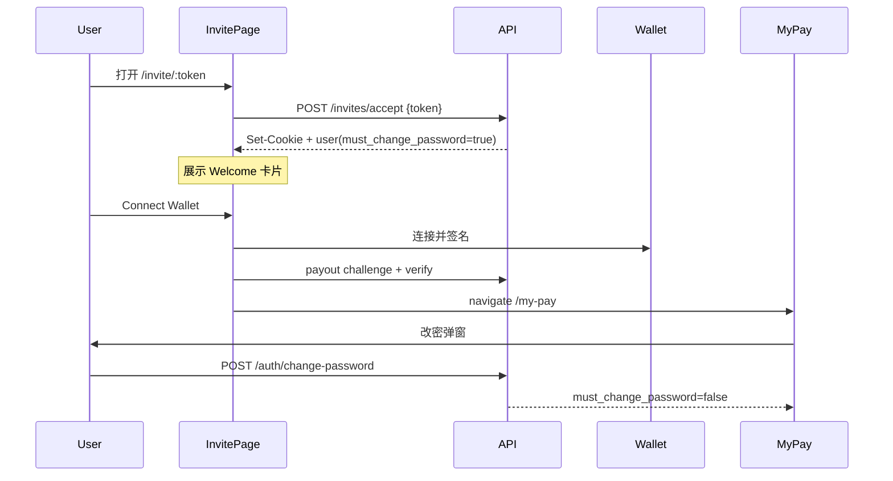

# Auth / Invite 页面重设计与自动登录

## 调研结论

- 邀请邮件链接仅为 `APP_URL/invite/{token}`（无 query）；Name/Email/Type/Role 已存在 invitation 行，accept 时回填。
- 现有 invite 页要求用户填密码；无 `must_change_password`、无改密 API。
- [`CreateTeamView.tsx`](src/views/admin/CreateTeamView.tsx) 布局可直接复用：`#C8E458` 底 + `/teams/dollar-mark.svg` 水印 + `/logo.svg` + Rubik One slogan + 白卡片 `rounded-[20px]`。
- Figma：登录（`67:14014`）= Sign in 表单；邀请打开（`89:15312`）= Welcome + 邮箱头像 + Connect Wallet（无密码框）。

## 选定流程

**默认密码策略（已选定）**：打开带 token 的邀请链接时，前端自动调用 accept；后端用 `crypto.getRandomValues` 生成 ≥24 字符随机密码并哈希入库（每人不同，不回传明文）；`must_change_password=1`；设 session cookie 完成自动登录。默认密码仅作占位，用户通过改密弹窗设定真正密码。

**`accountExists=true`**：不自动 accept，卡片提示已有账号并链到 `/login`（产品以新员工邀请为主）。

## 1. 后端

- 新 migration [`api/migrations/0015_must_change_password.sql`](api/migrations/0015_must_change_password.sql)：`users.must_change_password INTEGER NOT NULL DEFAULT 0`。
- 扩展 [`AuthUser`](api/src/types.ts) / `toAuthUser` / `loadUser`：暴露 `must_change_password: boolean`。
- 改造 [`POST /api/invites/accept`](api/src/routes/invites.ts)：支持仅 `{ token }`  
  - 从 invitation 取 email/name；新用户生成随机密码 + `must_change_password=1`  
  - 已有账号（同邮箱）→ 401/409，提示去登录  
  - resolve 响应补充 `name`（头像首字母用）
- 新增 [`POST /api/auth/change-password`](api/src/routes/auth.ts)：`{ currentPassword?, newPassword }`；邀请用户可仅传 `newPassword`（当 `must_change_password`）；成功后清 flag。
- 更新 [`docs/api/auth.md`](docs/api/auth.md)、[`docs/api/invites.md`](docs/api/invites.md)、[`docs/architecture.md`](docs/architecture.md)。

## 2. 共享 Auth 布局（复用 create-team）

新建 [`src/views/auth/AuthShell.tsx`](src/views/auth/AuthShell.tsx)（常量放 [`src/views/auth/config.ts`](src/views/auth/config.ts)，复用 `CREATE_TEAM_BG` 或同色常量）：

- 全屏 lime 背景 + 左右 dollar-mark
- 居中 logo + “Pay Beyond Borders.”
- children：白卡片表单区

登录/注册/无 token 的 `/invite`、带 token 的 Welcome 页均包在此 Shell 内（无 AppHeader，与现 auth 路由一致）。

## 3. 页面 UI（对齐 Figma）

| 页面 | 改动 |
|---|---|
| [`LoginView`](src/views/auth/LoginView.tsx) | AuthShell + Sign in 卡片（Email/Password/`#f6f6f6` input、黑 CTA、底链 “New here, create an account”） |
| [`RegisterView`](src/views/auth/RegisterView.tsx) | 同壳；字段 Name/Org/Email/Password；底链回登录 |
| [`InviteView`](src/views/auth/InviteView.tsx) 无 token | 同壳；粘贴邀请链接 + Continue（样式对齐登录） |
| [`InviteView`](src/views/auth/InviteView.tsx) 有 token | resolve → auto accept → Welcome 卡片：头像字母、email、文案 “Welcome to join **{org}** on DeCash…”、**Connect Wallet** |

表单控件样式对齐 CreateTeam：`font-montserrat`、label `#909090`、input `h-10 rounded-[6px] border-[#e3e3e3] bg-[#f6f6f6]`、按钮 `h-[50px] rounded-[12px] bg-black`。

## 4. 邀请页钱包校验

- 路由：[`RedirectIfAuthed`](src/router/guards.tsx) **不对** `/invite/:token` 生效（或仅在 accept 完成且已校验钱包后才重定向），否则自动登录会被立刻踢到 `/my-pay`。
- Connect Wallet：`useOpenWalletModal` + 连接后用默认 `USDC`/`Base` + 连接地址作 endpoint，走现有 [`createPayoutChallenge` / `verifyPayout`](api/src/routes/records.ts)（与 [`usePayoutOwnership`](src/hooks/use-payout-ownership.ts) 相同逻辑，可抽轻量调用或局部复用）。
- 校验成功 → `navigate('/my-pay', { state: { promptChangePassword: true } })`。

## 5. 改密弹窗

- 新组件如 [`src/views/auth/ChangePasswordDialog.tsx`](src/views/auth/ChangePasswordDialog.tsx)（或 `src/components/`）。
- 在 [`MyPayView`](src/views/employee/)（或 AppLayout employee）当 `user.must_change_password` 为 true 时自动打开；改成功后更新 auth store，之后不再提示。
- 前端 API：[`src/lib/api.ts`](src/lib/api.ts) + [`use-auth-api.ts`](src/hooks/use-auth-api.ts) 增加 `changePassword`；`AuthUser` 增加字段。

## 关键文件

- 布局参考：[`CreateTeamView.tsx`](src/views/admin/CreateTeamView.tsx)、[`create-team/config.ts`](src/views/admin/create-team/config.ts)
- Auth 页：[`LoginView.tsx`](src/views/auth/LoginView.tsx)、[`RegisterView.tsx`](src/views/auth/RegisterView.tsx)、[`InviteView.tsx`](src/views/auth/InviteView.tsx)、[`auth-shared.tsx`](src/views/auth/auth-shared.tsx)
- API：[`invites.ts`](api/src/routes/invites.ts)、[`auth.ts`](api/src/routes/auth.ts)、[`types.ts`](api/src/types.ts)、[`middleware.ts`](api/src/middleware.ts)
- 路由：[`guards.tsx`](src/router/guards.tsx)、[`router/index.tsx`](src/router/index.tsx)
