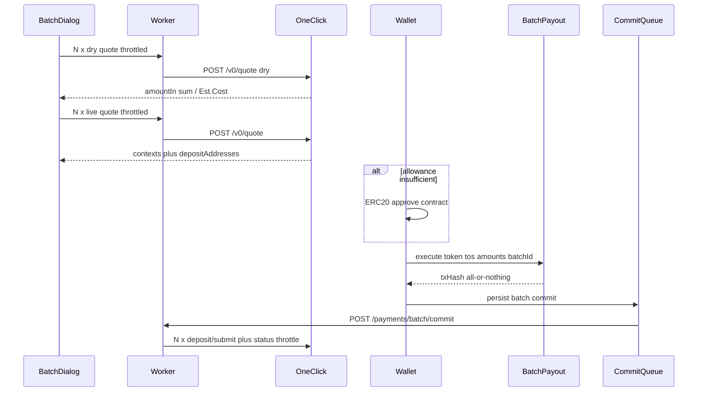

# 批量发薪（Batch Payout）

## 背景与约束

1Click 单笔本质是：报价拿到 `depositAddress`，再对该地址做 ERC-20 转账。批量发薪 **只走 standard 模式**（与当前 Quick Pay 前端一致），不走 private / intent 签名。员工收款链/币仍从 1Click `/v0/tokens` 动态取；管理员 **支付出链** 必须落在已部署合约的链上，避免 1Click 新增链但合约未部署导致失败。

本次合约 **仅部署 Arbitrum 主网**。配置里先登记全部目标链：`arb, op, eth, avax, base, bsc, gnosis, pol, monad, xlayer, bera, scroll, plasma`，未部署的链不出现在批量 You Pay 的 origin 选择器中。

Quote deadline 约 **10 分钟**。Live quote 必须在签名前尽快完成；建议单次上限 **50 人**（并发 2–3 时报价约 1 分钟，剩余时间足够 approve + execute）。



## Ⅰ. 独立合约项目 `contracts/`

根目录新建 **Foundry** 项目，**不加入** pnpm workspace，不引用根目录依赖。

建议结构：

- [`contracts/foundry.toml`](contracts/foundry.toml)、`src/BatchPayout.sol`、`test/BatchPayout.t.sol`、`script/Deploy.s.sol`、独立 `README.md`

合约要点（approve 模式，不用 permit / permit2）：

- `execute(address token, address[] tos, uint256[] amounts, bytes32 batchId, uint256 deadline)`
- `SafeERC20.transferFrom(msg.sender, tos[i], amounts[i])` 循环；**任一次失败整笔 revert**
- `usedBatchIds[batchId]` 防重放；`deadline` 防过期报价被提交
- `tos.length == amounts.length && length > 0`；`amount > 0`、`to != 0`
- 无 owner 也可工作（只花 `msg.sender` 已 approve 的余额）
- 测试：部分 transfer 失败全 revert、同一 `batchId` 第二次 revert、deadline 过期 revert

部署：仅 `arb`（42161）。地址写入前后端同一份链配置（见下）。

## Ⅱ. 出链配置（防止未部署合约）

新增两份小配置（有意重复、互不 import，避免 `api` 依赖前端）：

- [`src/config/batch-payout-chains.ts`](src/config/batch-payout-chains.ts)
- [`api/src/batch-payout-chains.ts`](api/src/batch-payout-chains.ts)

```ts
export const BATCH_PAYOUT_PLANNED = ["arb","op","eth","avax","base","bsc","gnosis","pol","monad","xlayer","bera","scroll","plasma"] as const;
export const BATCH_PAYOUT_CONTRACTS: Partial<Record<string, { chainId: number; address: `0x${string}` }>> = {
  arb: { chainId: 42161, address: "0x..." }, // deploy 后填入
};
export function isBatchPayoutOriginEnabled(blockchain: string): boolean
```

- 批量 You Pay 的 `TokenNetworkDialog` 增加 `allowedBlockchains`，只展示已部署合约的链
- 员工 destination **不过滤**，仍用 1Click token 列表
- 后端 commit 校验 `originNetwork` 必须在 `BATCH_PAYOUT_CONTRACTS` 内，且请求里的 `contractAddress` 与配置一致
- 本次 **不改** Quick Pay 的 origin 链范围

[`src/wallet/evm/config.ts`](src/wallet/evm/config.ts) 已含 Arbitrum；后续部署 monad/xlayer/bera/plasma 时再补 wagmi chain。本次只动 arb。

[`src/wallet/evm/transfer.ts`](src/wallet/evm/transfer.ts) 增补 `encodeErc20Approve`、`readErc20Allowance`（与现有 `encodeErc20Transfer` 并列，供批量使用）。

## Ⅲ. 全局节流（quote / status 防 429）

现状：[`api/src/intents.ts`](api/src/intents.ts) 无重试、无并发上限；cron 每分钟顺序 reconcile 5 条。

- 后端 [`api/src/throttle.ts`](api/src/throttle.ts)：`fetchWithRetryAfter`（429/503 + `Retry-After` / 指数退避）+ isolate 内 semaphore（建议 concurrency **2**）
- 所有 1Click `POST /v0/quote`、`GET /v0/status`、`POST /v0/deposit/submit` 走该包装
- 前端 [`src/lib/async-pool.ts`](src/lib/async-pool.ts)：`mapPool(items, fn, { concurrency: 3 })`，批量 dry/live quote 使用
- Worker 多 isolate **无法**做真全局互斥；前端限并发 + 后端 429 重试是实际有效组合。不引入 Durable Object。
- Reconcile 保持顺序调用（已限 5），但走 429 包装；批量提交后 Pending dock / cron 仍按 attempt 对账

**不要**做「一次 HTTP 内循环 N 次 quote」的后端 batch-quote：Workers 墙钟容易超时。继续复用现有 `POST /payments/quick-pay/quote`，由前端编排。

## Ⅳ. 数据模型与 API

新迁移 [`api/migrations/0023_payment_batches.sql`](api/migrations/0023_payment_batches.sql)：

- `payment_batches`：`id, org_id, origin_asset_id, origin_network, origin_token, contract_address, batch_id (bytes32 hex), tx_hash, total_amount_in, item_count, status (processing|partial|completed|failed), created_by, created_at, updated_at`
- `payment_batch_items`：`id, batch_id, employee_id, employee_payment_id, attempt_id, employee_name, amount_minor, token, network, memo, deposit_address`
- `payment_attempts` 增加可空 `batch_id`（关联查询，不影响现有 Quick Pay）

新接口（admin）：

| Method | Path | 作用 |
|---|---|---|
| POST | `/api/payments/batch/commit` | 校验 N 个 HMAC context + 同一 signer/origin/contract，插入 batch + N 组 `employee_payments` / `payment_attempts` / `chain_records`，再节流 `deposit/submit` |
| GET | `/api/payments/batches?page&pageSize` | 批次列表（含成功/失败/处理中计数） |
| GET | `/api/payments/batches/:id` | 批次详情（每人状态，来自关联 attempt / employee_payment） |

Commit 规则：

- 复用 [`verifyQuickPayContext`](api/src/quick-pay-context.ts)，每笔仍是 1 context = 1 deposit
- 同一 `txHash` 对应 N 个 deposit（合约一笔打出）
- `batchId` 由前端在 live quote 完成后生成（`keccak256` of sorted deposit addresses + origin + timestamp/uuid），写入合约并随 commit 提交；DB unique `(org_id, batch_id)` 防重放
- 幂等：相同 `batch_id` 再 commit 返回 `reused: true`
- D1 `batch()` 按约 40 条 statement 分片（50 人 × 3 表会超单次上限）
- 对账 **不新写状态机**：现有 [`reconcilePaymentAttempt`](api/src/payment-execution.ts) 已按 **每人自己的** `depositAddress` 调 `GET /v0/status`，SUCCESS 时用 `swapDetails.destinationChainTxHashes[0]` 写入该 attempt 的 `destination_tx_hash` / `destination_tx_explorer_url`，并更新 `employee_payments.status`。列表聚合：全 paid → `completed`；有 failed/refunded 且其余终态 → `partial`；仍有非终态 → `processing`

### 每人两笔 tx（必须落在 attempt 上，不能只记在 batch 行）

批量链上只有 **一笔** 管理员付款 tx（`BatchPayout.execute`），但 1Click 仍是 **N 笔独立 swap**，每人有自己的 `depositAddress` 和收款链 tx。

| 字段 | 含义 | 批量时 |
|---|---|---|
| `payment_attempts.deposit_tx_hash` | 管理员 Payment Tx（origin 链） | N 人 **同一** 合约 `txHash` |
| `payment_attempts.destination_tx_hash` | 员工 Receive Tx（destination 链） | **每人独立**，对账 SUCCESS 后才有；未到账前为 null |

Commit 必须为每人插入完整的 `employee_payments` + `payment_attempts` + `chain_records`（与 Quick Pay 同形），这样现有读接口 **不用改查询语义** 就能带出收款 tx：

- 管理员 [`GET /api/org/payments`](docs/api/org.md) → `adminTxHash` / `receiveTxHash`（[`PaymentHistoryTable`](src/views/admin/payment-history/components/PaymentHistoryTable.tsx) 的 Payment Tx / Receive Tx）
- 管理员员工详情 [`GET /api/org/employees/:id/payments`](docs/api/org.md) → [`RecipientDetailCard`](src/views/admin/recipients/components/RecipientDetailCard.tsx) 历史
- 员工端 [`GET /api/records/me`](docs/api/records.md) → [`MyPayHistoryTable`](src/views/employee/my-pay/components/MyPayHistoryTable.tsx) 的收款 tx 链接

批次 Tab 展开行同样展示这两列（Payment Tx 可重复、Receive Tx 各不相同）。不要只在 `payment_batches.tx_hash` 记一笔总账而省略每人 `destination_tx_hash`。

文档：更新 [`docs/api/payments.md`](docs/api/payments.md)、[`docs/architecture.md`](docs/architecture.md)（英文）。

前端持久化队列：仿 [`src/stores/quick-pay-commit-queue.ts`](src/stores/quick-pay-commit-queue.ts) 新增 `batch-payout-commit-queue.ts`，签名拿到 `txHash` 后立刻入队，避免关页丢 commit。`AppLayout` 对 admin flush。

## Ⅴ. 复用拆分（避免复制 / 避免把 QuickPayPanel 撑爆）

从 [`QuickPayPanel.tsx`](src/components/quick-pay/QuickPayPanel.tsx) 抽出，Quick Pay 与 Batch 共用：

- `usePaymentWallet()`：`boundAddress`、`connectAndBindWallet`、`ensureWalletReady()`（connect → bind → 校验与 DB 地址一致）
- [`YouPaySection`](src/components/you-pay/YouPaySection.tsx)：You Pay 标题右侧钱包、origin token 按钮、金额、`TokenNetworkDialog`（支持 `allowedBlockchains`）
- [`EstCostRow`](src/components/you-pay/EstCostRow.tsx)：费用 + 时间
- Recipients 列展示：把 Name/Type/Compensation/Schedule/Wallet 抽到 [`recipients/components/RecipientCells.tsx`](src/views/admin/recipients/components/RecipientCells.tsx)，页面表与批量选人表共用；**不要**给 `RecipientsTable` 堆 10 个可选 props

[`TokenNetworkDialog`](src/components/token-network-dialog/TokenNetworkDialog.tsx) 增加可选 `allowedBlockchains?: string[]`。

[`PayNowDialog`](src/views/admin/recipients/components/PayNowDialog.tsx) 保持不变，失败补发直接打开它。

## Ⅵ. 批量发薪向导弹窗 UI

入口：[`QuickPayPanel`](src/components/quick-pay/QuickPayPanel.tsx) 标题行改为 `Quick Pay` 左侧、右侧 **Batch payout** 按钮（`hideTitle` 的 Pay Now 嵌入不显示该按钮）。

点击前走 `ensureWalletReady()`（与 You Pay 右侧同一套逻辑）：未连接则拉起 RainbowKit；未 bind 则 bind；已 bind 但当前账户不一致则 toast 切钱包，不打开弹窗。

弹窗模块 [`src/components/batch-payout/`](src/components/batch-payout/)：单 Dialog + `step: 1|2|3`，上一步/下一步。支持 `initialEmployeeIds`（失败名单再批量）。

**Step 1 选人**

- 复用 `useRecipientsQuery` + [`Pagination`](src/components/pagination/index.tsx)（`PAGE_SIZE = 10`）
- 列：Name、Type、Compensation、Schedule、Wallet（无 Payout、无行菜单）
- 跨页勾选：`Map<id, Employee>` 存快照；未验证（`!isVerified`）checkbox disabled
- 上限 50；超出 toast

**Step 2 金额 / Memo**

- 默认带出周期工资（`amount_minor`，为 0 则空）；校验 **> 0**
- 每人可选 Memo
- 校验失败不可进入 Step 3

**Step 3 You Pay + Review/Sign**

- 复用 `YouPaySection`（origin 仅已部署链）+ 员工收款合计
- 「明细」默认折叠：`name + 数量 + TokenChainIcon`（token 正圆，链图标在右下角 **2px 圆角矩形**）+ 有则显示 Memo
- Est. Cost 在 Review 完成前可占位；完成后用 dry quote 汇总：`You Pay = sum(amountIn)`，fee ≈ `sum(in)-sum(out)`，time = `max(timeEstimate)`
- 底部：**Review** → dry 批量报价 + 进度百分比；成功后按钮变 **Sign**
- origin / 金额 / 选人变化则清掉报价，按钮回到 Review
- **Sign** → live 批量报价 + 进度；全部成功后：
  1. 若 `allowance < sum(amountIn)` 先 `approve`（精确总额即可）
  2. 再 `BatchPayout.execute(...)`
  3. enqueue batch commit → toast「Payment submitted」→ 关弹窗
- dry 或 live **任一人失败**：停在当前步，展示该行错误，不拉起签名（与合约 all-or-nothing 一致；结算失败才进入「部分失败」）
- 进度条：`completed / total`

## Ⅶ. `/payments` 批次 Tab

[`PaymentHistoryView`](src/views/admin/PaymentHistoryView.tsx) 增加 Tabs：`Payments`（现有列表）| `Batches`。

Batches：

- 分页列表；每行默认 **收起**（时间、人数、You Pay 总额、聚合状态）
- 展开：每人 name、金额、token+链图标、memo、状态、**Payment Tx**（共享 origin `txHash`）、**Receive Tx**（对账后的 `destination_tx_hash`，未到账显示 —）；`failed` / `refunded` 显示 **Retry pay**（打开 `PayNowDialog`）
- 展开区提供 **Retry failed in batch**（打开 Batch 弹窗并 `initialEmployeeIds` = 失败员工）
- 状态随现有 pending reconcile / cron 更新，列表 query 适当 refetch
