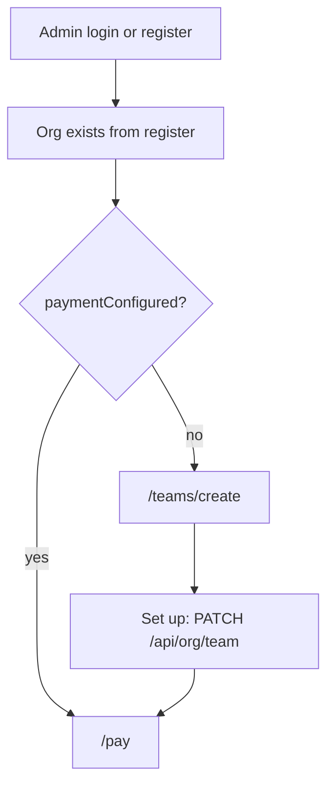

# Create Team 页面实现计划

## 产品定位（已确认）

- 注册仍强制 `orgName`；组织在 register 时已创建。
- 本页**不是**创建 org，而是为当前 team（org）补充 **Payment Schedule**（月/周）。
- **Team Name 只读**；标签 **Payment Date**（设计已去掉 Regualr 拼写）。
- **去掉日结**；Schedule 仅 `Monthly` / `Weekly`。
- **不复用** `api.createRun` / 不创建 `payroll_runs`；发薪周期是 **team 配置**，与 run 域分离。
- UI 英文；代码/注释/docs 英文；本 plan 中文。

### Regular Payment Date 枚举（英文 UI）

| Schedule | Payment Date 选项 |
|---|---|
| Monthly | `Every 1st` / `Every 15th` / `Every end of month` |
| Weekly | `Every Monday` … `Every Sunday` |

### Helper 文案（随 Schedule 切换）

- Monthly：`The payroll reminding will starts from 7 days before payment day.`
- Weekly：`The payroll reminding will starts from 3 days before payment day.`

（按设计保留原文语法；写入 DB 的 lead days 分别为 **7** / **3**。）

## 最新 Figma（node `59:13047`）

相对上一版的视觉变化：

- 整页背景 **`#c8e458`**（石灰绿），非灰底
- 左右大号半透明 **`$`** 装饰图（需从 Figma 导出落到 `public/`，例如 `public/decash/dollar-mark.svg`）
- 居中 logo：继续用 [`public/logo.svg`](public/logo.svg)（按产品约定）
- Slogan：`PAY BEYOND BORDERS.`（**Rubik One**，字体缺失需你补文件）
- 注解：`Starts with creating your team.` + [`public/icons/to-bot-right.svg`](public/icons/to-bot-right.svg)
- 白卡片表单 + 黑按钮 `Set up`
- 右上角钱包 chip（无主导航）

## API：新增更新 team（与 run 分离）

### 为何不改 createRun

`POST /api/payroll` 会插入 `payroll_schedules` **并**创建 draft `payroll_runs`。本页只配置 team 发薪偏好，**一期不生成任何 run**。

### 数据模型（需 migration）

[`api/migrations/0010_org_payment_setup.sql`](api/migrations/0010_org_payment_setup.sql) 扩展 `organizations`：

```sql
-- Team payment preferences (phase 1: one org per admin).
-- Separate from payroll_runs / createRun.
ALTER TABLE organizations ADD COLUMN payment_cadence TEXT;       -- monthly | weekly
ALTER TABLE organizations ADD COLUMN payment_date_key TEXT;     -- every_1st | every_15th | every_end_of_month | every_monday | ... | every_sunday
ALTER TABLE organizations ADD COLUMN reminder_lead_days INTEGER; -- 7 monthly, 3 weekly
ALTER TABLE organizations ADD COLUMN payment_configured_at TEXT;
```

- **不必**加 `anchor_hour` / `daily`。
- **不必**为本页写 `payroll_schedules`（避免与 run materialize 纠缠）。日后 Pay 域若要自动出 draft，再从这些 org 字段派生 schedule。

### 新接口

`PATCH /api/org/team`（admin）

- Client：`api.updateTeam`
- Request：

```ts
{
  paymentSchedule: "monthly" | "weekly";
  paymentDate:
    | "every_1st" | "every_15th" | "every_end_of_month"
    | "every_monday" | "every_tuesday" | "every_wednesday"
    | "every_thursday" | "every_friday" | "every_saturday" | "every_sunday";
}
```

- 校验：`paymentDate` 必须属于对应 schedule；**忽略/拒绝改 name**（本页只读）。
- 服务端派生 `reminder_lead_days`：monthly→7，weekly→3；写 `payment_configured_at = now`。
- Response：`{ org: { id, name, country, payment_cadence, payment_date_key, reminder_lead_days, payment_configured_at } }`
- Audit：`org.team_payment_updated`
- 幂等：允许已配置后再次 PATCH（更新偏好）；**前端 onboarding** 在已配置时仍重定向离开本页。

### context 扩展（onboarding 判定）

`GET /api/org/context` 增加：

- `paymentConfigured: boolean`（`payment_configured_at != null`）
- 可选带回 `payment_cadence` / `payment_date_key` / `reminder_lead_days`

现有 `PATCH /api/org`（改 name/country）保持不变，与 team payment setup 分离。

文档：[`docs/api/org.md`](docs/api/org.md)、[`docs/api.md`](docs/api.md)。

## 页面流程



- 判定：admin + `!paymentConfigured`（来自 `orgContext`，勿用 schedules/runs）。
- 登录/注册成功、`HomeRedirect`、`RedirectIfAuthed`：未配置 → `/teams/create`，否则 → `/pay`。
- 已配置访问 `/teams/create` → `/pay`。
- 提交成功 → invalidate context → refresh auth store → `navigate("/pay")`。

## UI 实现

**落点：** [`src/views/admin/CreateTeamView.tsx`](src/views/admin/CreateTeamView.tsx) + `src/views/admin/create-team/{config,utils}.ts`。

**Chrome：**

- [`AppHeader`](src/components/layout/AppHeader.tsx)：`/teams/create` 隐藏主导航；保留钱包 chip + 菜单。
- 页面自绘：石灰绿全屏底、左右 `$`、居中 logo/slogan/表单（不依赖 `page-container` 灰底）。

**表单：**

- Team Name：只读，值 = `org.name`
- Payment Schedule / Payment Date：复用 [`src/components/ui/select.tsx`](src/components/ui/select.tsx)；箭头 `/icons/to-down.svg`
- Schedule 切换：重置 Date 默认值 + 切换 helper（7 vs 3 days）
- CTA：`api.updateTeam` via `useMutation`

**常量：** schedule/date keys、英文 labels、helper 文案 → `config.ts`（`UPPER_SNAKE_CASE`）。

**资源：** Figma `$` 装饰下载到 `public/decash/`（MCP URL 会过期）。

## 字体

- 缺失：**Rubik One**（slogan）→ `@font-face` + `--font-rubik-one`；文件你放到 `public/fonts/`（建议 `RubikOne-Regular.woff2`）
- 已有：Montserrat、Space Grotesk、Geist

## 多 org 预留（一期单 org）

- `auth` store / `updateTeam` / context：注释标明 `org_id` 为一期 current workspace；未来 membership + `activeOrgId`
- queryKey：`["org-context", orgId]`
- [`docs/architecture.md`](docs/architecture.md)：Create Team = payment setup；Phase 1 single org；team payment fields on `organizations`，与 payroll runs 分离

## 明确不做

- 不扩展 `daily` / `anchor_hour`
- 不调用 `createRun`、不插入 `payroll_runs` / 不为 setup 写 `payroll_schedules`
- 不在本页改 org name

## 关键文件

- 后端：`api/migrations/0010_org_payment_setup.sql`、[`api/src/routes/org.ts`](api/src/routes/org.ts)、[`src/lib/api.ts`](src/lib/api.ts)
- 前端：`CreateTeamView`、`create-team/*`、`AppHeader`、`guards`、auth store、`styles.css`
- 资源：`public/logo.svg`、`public/icons/to-bot-right.svg`、`public/icons/to-down.svg`、新建 `$` 装饰
- 文档：`docs/api/org.md`、`docs/architecture.md`
