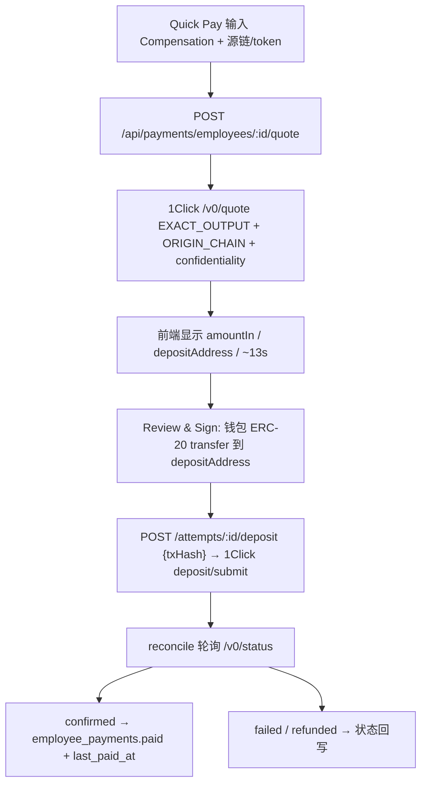

# Decash Pay 页（管理员首页）重构计划

## 背景与调研结论

- [src/views/admin/PayView.tsx](src/views/admin/PayView.tsx) 目前是占位符；壳层 `AppLayout` + `AppHeader` 保留。
- 现有支付链路（legacy [src/components/PayDialog.tsx](src/components/PayDialog.tsx) + [api/src/routes/payments.ts](api/src/routes/payments.ts)）确认为 **Confidential Intents「Embedded」模式**：`depositType: CONFIDENTIAL_INTENTS` + ERC-191 签名意图执行，要求资金已在保密余额内。本次改为 **foreign-to-foreign 模式**：`depositType: ORIGIN_CHAIN`（管理员 EOA 在源链把 ERC-20 转到 quote 返回的 depositAddress）+ `recipientType: DESTINATION_CHAIN` + `confidentiality` 参数（env 可配置，默认 `advanced`），不再需要 generate-intent/submit-intent。
- 报价保持 `EXACT_OUTPUT`：`amount` = Compensation（员工到账量），You Pay / Est. Cost 显示响应的 `amountIn`；`timeEstimate` 显示为 ~Ns。
- `GET https://1click.chaindefuser.com/v0/tokens` 公开可用（实测 186 个 token；USDT0 在 arb/bera/monad/plasma/xlayer，视为 USDT）。
- DB（[api/migrations](api/migrations)）无 employee/contractor 区分、无首页统计和按周期的支付状态计算——需迁移与新接口。
- 已确认决策：Quick Pay 记录走**独立 `employee_payments` 表**（attempt 挂员工+周期，逐步废弃 payroll run 体系）；confidentiality **env 可配置默认 advanced**。

## 一、数据库迁移（api/migrations）

1. `0011_employee_type.sql`
   - `employees.employee_type` TEXT NOT NULL DEFAULT `'employee'`（`employee` | `contractor`）。
   - Contractor 自有发薪周期字段留到 Recipients 页重构时再加（本页统计只针对 employee；代码留注释）。
2. `0012_employee_payments.sql`
   - 新表 `employee_payments`：`id, org_id, employee_id, period_key`（如 `2026-08` / `2026-W33`）、`amount_minor, token, network, status(pending|processing|paid|failed|refunded), paid_at, created_at, updated_at`，`UNIQUE(org_id, employee_id, period_key)`。
   - `payment_attempts` 增加：`employee_payment_id`（可空，兼容旧 run item 路径）、`deposit_tx_hash`、`origin_asset_id` / `destination_asset_id`。

## 二、后端（api/src）

1. **周期计算模块** `api/src/pay-period.ts`（纯函数 + 单测思路，全 UTC）：
   - 由 `organizations.payment_cadence` + `payment_date_key` + `reminder_lead_days` 推算：当期 `period_key`、payday（Expired Date）、提醒窗起点（payday − lead days 的 UTC 0 点）。
   - 每员工状态：提醒窗内未付 → `to_be_paid`；存在早于当期（且晚于 `employees.created_at`）的未付周期 → `to_be_paid`；无欠款且当期已付 → `paid`；提醒窗前且未付 → `none`。数据源 `employee_payments`。
2. **首页聚合接口** `GET /api/org/pay-overview`（[api/src/routes/org.ts](api/src/routes/org.ts)）：
   - `currentPayrollMinor`（employee 类型薪资合计）、`payday`、`recipientsCount`（正式工数）、`toBePaidCount`、`paidCount`、`progress`；
   - `highPriority`: 当期到提醒窗的 payroll 汇总（应付人数/金额）+ 未验证钱包员工列表；
   - `recipients`: 最新添加的 6 位员工（含 verified 状态、role_title）。
3. **Quick Pay 支付接口**（[api/src/routes/payments.ts](api/src/routes/payments.ts) 新增，旧 run 路径保留不动、标记 deprecated）：
   - `POST /api/payments/employees/:employeeId/quote`：body 含 `originAsset`（管理员所选源链+token 的 assetId）、`amount`（到账量，默认员工薪资）、幂等 key。创建/复用 `employee_payments` + `payment_attempts`，调 1Click `/v0/quote`：`EXACT_OUTPUT`、`depositType: ORIGIN_CHAIN`、`recipientType: DESTINATION_CHAIN`、`refundTo` = 管理员 EOA、`confidentiality` = env `INTENTS_CONFIDENTIALITY`（默认 `advanced`）。返回 quote（`amountIn`、`depositAddress`、`timeEstimate`、deadline）。
   - `POST /api/payments/attempts/:attemptId/deposit`：body `{ txHash }`，校验后转发 1Click `/v0/deposit/submit`，attempt 进入 `deposit_submitted`。
   - 复用/扩展 reconcile：`checkSwapStatus` 轮询，terminal 时更新 `employee_payments.status` + `employees.last_paid_at`。
   - Attempt 状态机调整：`created → quoting → quoted → awaiting_deposit → deposit_submitted → processing → confirmed | failed | refunded`。
4. **动态资产解析**（[api/src/intents.ts](api/src/intents.ts) / [api/src/payment-state.ts](api/src/payment-state.ts)）：
   - 弃用 `INTENTS_ASSET_MAP` env：quote 前从 `/v0/tokens` 解析 assetId/decimals（Worker 内存缓存 30min）。
   - 稳定币过滤规则独立成配置模块 `api/src/assets.ts`：symbol ∈ {USDT, USDT0→USDT, USDC}；一期仅 EVM 链白名单（eth/base/arb/op/pol/bsc/avax/gnosis/scroll/monad/xlayer/plasma/bera），链种类字段预留非 EVM 扩展。
5. `GET /api/org/employees` 响应补充 `employee_type`、当期 `payStatus`。

## 三、前端基础设施（src）

1. **格式化工具** `src/lib/format.ts`：`formatNumber` / `formatCurrency`（`Intl.NumberFormat("en-US")`）、`formatDate`（`Intl.DateTimeFormat("en-US")`，如 `Sep 1, 2026`）；全页统一使用。
2. **Logo 工具** `src/lib/logo.ts`：参照 [stableflow-interface/src/utils/format/logo.ts](../stableflow/stableflow-interface/src/utils/format/logo.ts)，从 `https://assets.dapdap.net` 取链图标（方形圆角 4）、token 图标（正圆）、路由图标（nearintents）。
3. **代币 store** `src/stores/intents-tokens.ts`（zustand）：直接拉 1Click `/v0/tokens`，按 `assets` 配置过滤为 EVM 稳定币结构（chain → USDT/USDC），localStorage 持久化 + `fetchedAt`，30 分钟自动刷新；链注册表 `src/config/chains.ts`（blockchain code → chainId、chainName、logo、chainKind 预留非 EVM）。
4. **全局抽屉**：项目已有 shadcn [src/components/ui/sheet.tsx](src/components/ui/sheet.tsx)（Radix，右侧滑出）作为基础。新增 `src/stores/drawer.ts`（zustand：`openRecipientPicker(payload)` 等）+ `src/components/drawer/GlobalDrawerHost.tsx` 挂在 `AppLayout` 管理员分支下，任何页面可通过 store 打开。
5. 钱包：走 `useWallet("evm")`；需为 Quick Pay 扩展 adapter 支持「ERC-20 transfer 发送」与「指定链余额读取」（viem publicClient per chain，避免页面直接散用 wagmi）。

## 四、页面与组件（Figma 31:1110 / 59:12793）

1. `PayView` 组装：问候语 `Hi! {orgName}` + **禁用**的 team 下拉按钮（`/icons/to-down.svg`，disabled 态无 hover）；四格统计条（Current Payroll / Expired Date / Recipients+紫色 `N To be paid` 胶囊 / Payment Progress），数据来自 `GET /api/org/pay-overview`（react-query）。
2. **Quick Pay 模块** `src/components/quick-pay/QuickPayPanel.tsx`（独立封装可复用）：
   - Recipient 卡：头像、姓名、role 徽章、Employee/Contractor 徽章、Verified 徽章（绿圈 DOM + [src/components/icons/check.tsx](src/components/icons/check.tsx)）、`$5,000 / month`、紫色「{Month} payroll is to be paid」提示条（[src/components/icons/alert.tsx](src/components/icons/alert.tsx)）、右上 [close.tsx](src/components/icons/close.tsx) 清除；`Change` 按钮打开全局 Recipient 抽屉。
   - Compensation：金额输入（默认员工薪资）、右侧员工目标链+token 选择胶囊、右上员工收款地址缩写。
   - You Pay：显示 quote `amountIn`（只读）、右上管理员 EOA 地址/连接钱包、右侧源链+token 选择胶囊、`Balance:` 所选链上余额。
   - Est. Cost 行：金额 + 路由区（链图标 > 链图标 > nearintents 路由图标）+ `/icons/fee.svg` `$0.02`（费用=amountIn−amountOut 的 USD 估算）+ `/icons/duration.svg` `~{timeEstimate}s`。
   - `Review & Sign` 黑色主按钮 → 报价确认 → 钱包发送 ERC-20 transfer 至 depositAddress → 提交 txHash → 轮询 reconcile 展示结果。
   - 报价用 react-query（输入防抖、quote deadline 过期自动刷新）。
3. **Recipient 选择抽屉** `src/components/drawer/RecipientPickerDrawer.tsx`（Figma 59:12793）：标题 Recipient，All / Employees / Contractors 胶囊 tab，员工列表（头像、姓名、role，右箭头 = `to-down.svg` 旋转 −90°），点击选中并回填 Quick Pay。
4. **链/token 选择弹窗** `src/components/token-network-dialog/`：基于 [ui/dialog.tsx](src/components/ui/dialog.tsx) 的简单胶囊 tab 弹窗——上方 USDT / USDC 两个胶囊（左圆形 token 图标 + symbol），下方支持链列表（左方形圆角 4 链图标 + chainName），数据来自 tokens store；Compensation 与 You Pay 复用。
5. **Recipients 卡**：最新 6 位员工，Verified（绿）/ Unverified（灰）徽章，View All → `/recipients`；行右箭头跳 `/recipients` 并展开详情（先留注释 TODO，待 Recipients 页重构）。
6. **High Priority 卡**：两类条目——当期 payroll 到提醒窗（`/icons/payroll.svg` 风格图标 + 金额 + N payments ready）、未验证钱包员工（黄色感叹号圈 + 人名摘要）；View All 与详情跳转先 TODO。
7. 交互细节：所有可点击元素补 hover（胶囊按钮 `hover:bg-black/5`、行 hover 底色、主按钮 `hover:opacity-90` 等）；移动端 375px 单列堆叠（migration guide 硬性要求）；数字/日期一律走 `format.ts`。

## 五、新支付流程图

## 六、文档同步

- 更新 [docs/architecture.md](docs/architecture.md)（新 stores、抽屉、支付模式）与 [docs/api.md](docs/api.md) / [docs/api/payments.md](docs/api/payments.md) / [docs/api/org.md](docs/api/org.md)（新端点、迁移、env：`INTENTS_CONFIDENTIALITY`，弃用 `INTENTS_ASSET_MAP`）。
- 代码/UI/注释全英文；Figma 资产按需下载到 `public/`（MCP 链接 7 天过期）。

## 暂缓项（留 TODO 注释）

- Team 下拉切换（禁用）、High Priority View All 与详情、Recipients 行跳转展开详情、Contractor 自有周期字段与判定（Recipients 页重构时补）。