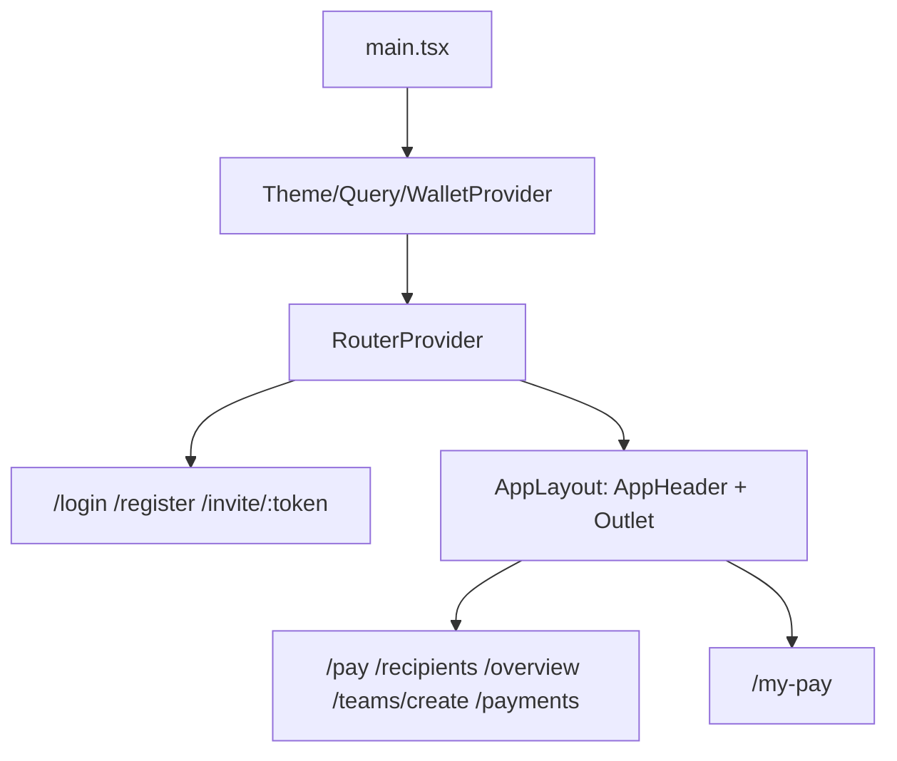

# DECash UI 架构重构（第一步：架构整理）

## 背景与现状

- 当前无路由:未登录时用 `pathname` 区分登录/邀请页，登录后 [src/App.tsx](src/App.tsx) 用 `screen` state 切换页面，URL 不变。
- 钱包:仅 EVM，`getDefaultConfig` 在 [src/lib/wallet.ts](src/lib/wallet.ts)，签名逻辑分散在 `PayDialog`、`use-payout-ownership`、`WalletConnect` 等处；且 `main.tsx` 缺少 `RainbowKitProvider`（现有隐患，本次一并修复）。
- 设计参照:已通过 Figma MCP 获取设计稿（node `59:11715`），头部规格已确认（见第 4 节）；[src/prototype/decash.css](src/prototype/decash.css) 的 `.dc-header` 可作响应式行为参照。
- 已确认:顶部导航按设计稿为 **Pay / Recipients / Overview**（用户已选定）。
- 头像复用现有 [src/components/IdentityAvatar.tsx](src/components/IdentityAvatar.tsx)。

## 1. 项目更名 DECash + favicon

- [index.html](index.html):title 改为 `DECash`，添加 `<link rel="icon" href="/favicon.ico">`（`public/favicon.ico` 已存在）。
- `package.json` name、wagmi `appName`、README 标题等由 SalaryFlow 改为 DECash（localStorage key 等运行时标识暂不动，避免破坏现有数据）。

## 2. 路由体系（react-router v7，声明式 `createBrowserRouter`）

安装 `react-router-dom`，新增:

```
src/router/index.tsx        // route table + guards
src/views/
├── auth/
│   ├── LoginView.tsx        // /login
│   ├── RegisterView.tsx     // /register
│   └── InviteView.tsx       // /invite/:token
├── admin/
│   ├── PayView.tsx          // /pay          (admin home, nav "Pay")
│   ├── RecipientsView.tsx   // /recipients   (nav "Recipients")
│   ├── OverviewView.tsx     // /overview     (nav "Overview")
│   ├── CreateTeamView.tsx   // /teams/create
│   └── PaymentHistoryView.tsx // /payments   (page-internal entry)
└── employee/
    └── MyPayView.tsx        // /my-pay       (employee home)
```

- 全部先做统一占位组件（页面名 + "Under construction"），后续按设计图逐页实现。
- 守卫:`RequireAuth`（未登录跳 `/login`）、按角色分流（`/` → admin 到 `/pay`，employee 到 `/my-pay`；employee 访问 admin 路由重定向）。登录态复用现有 `App.tsx` 中的 session 逻辑，抽到 zustand store（`src/stores/auth.ts`），路由守卫直接读取。
- 旧的 `src/pages/`、`Shell.tsx` 暂保留在仓库作为业务逻辑参照，不再挂载到入口；`/design-preview` 原型旁路保留。

## 3. 钱包多链架构抽象

新增 `src/wallet/` 模块，接口设计面向两个核心场景:管理端支付签名、员工端钱包地址所有权验证。

```
src/wallet/
├── types.ts        // ChainKind = "evm" | "near" | "solana"
│                   // WalletAdapter interface: kind, connect(), disconnect(),
│                   //   getAccount(), signMessage(msg), isAddressValid(addr)
├── evm/
│   ├── config.ts   // wagmi/rainbowkit config (moved from lib/wallet.ts)
│   └── adapter.ts  // EvmWalletAdapter implementation (wagmi hooks based)
├── WalletProvider.tsx  // wraps WagmiProvider + RainbowKitProvider (fix missing provider),
│                       // future: NearProvider / SolanaProvider mounted here
├── use-wallet.ts   // useWallet(chainKind) unified hook for UI layer
└── index.ts
```

- EVM adapter 内部继续走 rainbowkit/wagmi，现有 `erc191.ts`、challenge/verify 流程不变，只是签名入口统一从 adapter 走。
- NEAR/SOL 仅留接口与注释（英文），说明扩展方式:实现 `WalletAdapter` + 在 `WalletProvider` 挂载对应 provider + 在 registry 注册。
- 本步不改动 `PayDialog` 等业务组件内部逻辑（那些随页面重构再迁移到 adapter），仅完成架构与 provider 修复。

## 4. Header + Content 布局（按 Figma 设计稿 `59:11715`）

新增 `src/layouts/AppLayout.tsx`（header + `<Outlet/>` content）与 `src/components/layout/AppHeader.tsx`，用 Tailwind 实现，设计稿关键规格:

- 页面背景 `#f6f6f6`；header 无卡片底，直接置于页面背景上，元素高 42px、上下留白 20px（总高约 82px）。
- 左:logo 使用 `/logo.svg`（约 142x42，点击回首页）。设计稿为亮绿色 `#d0f348` 药丸 + DECASH 字标，logo.svg 已包含整体。
- 中:白色药丸容器（`rounded-[25px]`，高 42px，shadow `0 0 6px rgba(0,0,0,0.06)`）内三个导航项 Pay(`/pay`)、Recipients(`/recipients`)、Overview(`/overview`)；激活项为黑色药丸白字（宽约 108px），非激活为容器白底黑字；字体 Montserrat Medium 16px。员工端暂只显示适用项或同样占位。
- 右:钱包地址 chip（白底、黑色 20% 透明度描边、`rounded-[25px]`、高 42px；内含 30px 头像复用 `IdentityAvatar` + 缩略地址如 `XKO5...58dc1`，地址字体 Space Grotesk 14px）+ 竖三点菜单按钮（`/icons/menu.svg`，暂无展开内容，保持现状）。
- 字体:设计稿正文用 Montserrat、地址/数字用 Space Grotesk，需新增 `@fontsource` 依赖并在全局注册（logo 文字由 logo.svg 承载，不需 Rubik One）。
- auth 三个路由不套 AppLayout（无 header）。
- 本步只搭 header + content 骨架，content 内各页面具体内容不实现（占位）。
- **移动端响应式**:布局必须适配移动端，参照原型 [src/prototype/decash.css](src/prototype/decash.css) 的断点行为——窄屏时 header 变两行（logo + 钱包在第一行，导航整行居中在第二行）、钱包 chip 收起地址只留头像、导航药丸收窄；content 区左右留白随断点收缩。用 Tailwind 响应式前缀（`sm:` / `md:` / `lg:`）实现，移动优先。



## 5. 状态管理与数据请求约定

- 安装 `zustand`（用 pnpm 安装最新版），用于管理公共状态（如登录用户、当前 team 等 UI 全局态）；第 2 节的 auth 状态即用 zustand store 实现（替代前文的 context 方案）。
- 接口请求统一使用 `@tanstack/react-query`（已安装，`QueryClientProvider` 已挂载）:后续页面对接 API 一律走 `useQuery` / `useMutation` 封装，不在组件内手写 fetch + useState；现有 [src/lib/useData.ts](src/lib/useData.ts) 等旧数据逻辑随页面重构逐步迁移。
- 职责划分写入文档:server state 归 react-query，client/UI 共享状态归 zustand，组件局部状态用 useState。

## 6. 文档（docs/，全英文）

- `docs/architecture.md`:路由表、views 结构、wallet 抽象接口说明、布局体系、命名约定、响应式断点约定（断点值与 header/content 各断点下的行为）。
- `docs/page-migration-guide.md`:后续 agent 逐页重构的工作流（拿到 Figma 设计 → 在对应 View 实现 → 复用 `src/components/ui` 与 `IdentityAvatar` 等既有组件 → 更新文档），并明确要求:
  - keep code clean、prioritize component reuse、no Chinese in code/docs;
  - **every page MUST be mobile-responsive**:设计稿只给桌面版时也必须做移动端适配（mobile-first、使用统一断点、验证窄屏表现），作为每页重构的验收项写入文档;
  - **state & data conventions**:公共状态用 zustand、接口请求一律用 @tanstack/react-query（server state 与 client state 职责划分见 architecture 文档）;
  - **package manager**:使用 pnpm 安装/管理依赖，但不删除 `package-lock.json`、不加 preinstall 强制脚本，不强迫其他开发者也用 pnpm。

## 约定与假设

- 导航映射（已确认按设计稿）:Pay → `/pay`，Recipients → `/recipients`，Overview → `/overview`；Payment History、Create team 不在顶部导航，由页面内入口进入。
- 新路由 + 占位页直接成为应用入口，旧页面在重构完成前暂不可访问（保留代码作参照）。
- 代码与文档全英文，仅本 plan 为中文。