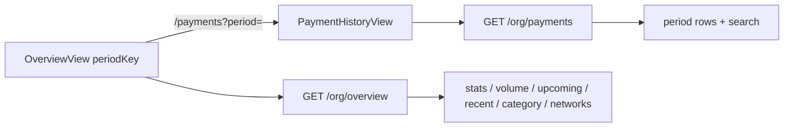

# Overview / Payment History 重构

## 调研结论

- [`OverviewView`](src/views/admin/OverviewView.tsx) / [`PaymentHistoryView`](src/views/admin/PaymentHistoryView.tsx) 均为 Placeholder；路由已挂好（`/overview`、`/payments`）。
- Pay 顶部统计来自 [`GET /api/org/pay-overview`](api/src/routes/org.ts)：仅 `employee_type=employee`，按 team `payment_cadence` 算当期 `periodKey` / payday / progress。
- 周期选择器已有：[`PaymentPeriodPicker`](src/components/payment-period-picker/PaymentPeriodPicker.tsx)（Recipients 已用）；**无**组织级支付列表 / 周期聚合 API。
- `package.json` **无** 图表库；**安装 `recharts`**（`pnpm add recharts`）实现 Payment Volume 柱状图与 Spend On Category 环形图，样式对齐 Figma（当前柱黑、其余浅灰；donut 灰阶、图例无 Vendors）。
- 员工类型仅有 `employee` | `contractor`（无 Vendors）；Spend Category 只展示这两类。

## 选定指标映射（相对 Figma）

顶部四格按 Figma 文案，计算对齐 Pay「仅正式工」规则；`periodKey` 由右上角选择器驱动：

| 格 | 文案 | 计算 |
|---|---|---|
| 1 | Paid This Month/Period | 所选周期 `employee_payments.status=paid` 金额合计（仅正式工）；副文案 `For N Employees` |
| 2 | Awaiting Actions | 所选周期尚未 `paid` 的正式工 `amount_minor` 合计；副文案 `M Payments` |
| 3 | Expired Date | 该周期 payday + `X Days Left` / `Overdue` |
| 4 | Payment Progress | 与 Pay 相同：已付正式工数 / 正式工总数 × 100%；副文案仅正式工人数（不显示承包商） |

其余模块：

- **Payment Volume**：最近 6/12 个周期（月→月、周→周）已付金额柱状图 + 环比 %；当前柱黑色，其余浅灰。
- **Upcoming**：从**真实当前周期**起共 4 个周期（当前+未来 3），已全部付清的周期隐藏；金额/人数仅正式工。`Review Payments` → `/payments?period=<periodKey>`。
- **Recent Payment**：最近 5 条 `employee_payments`（含 processing/paid）；状态图标用 `IconLoading` / `IconCheck`。`View All` → `/payments?period=<Overview所选>`。
- **Spend On Category**：当前 team 正式工 vs 承包商**人数占比**环形图（无 Vendors）。
- **Payout Networks**：当前员工 `network`（收款链）分布进度条。

周期传递：Overview 选中的 `periodKey` 经 URL `?period=` 传给 Payment History；History **暂不**做时间切换，仅展示该周期静态标题 + 搜索。



## 1. 后端：周期工具 + 两个 API

扩展 [`api/src/pay-period.ts`](api/src/pay-period.ts)：

- `resolvePeriodFromKey(cadence, dateKey, periodKey)` → payday
- `listPeriodWindows(cadence, dateKey, { direction, count, fromPeriodKey? })` → 过去/未来窗口列表

新增（写在 [`api/src/routes/org.ts`](api/src/routes/org.ts)，文档更新 [`docs/api/org.md`](docs/api/org.md) / [`docs/api.md`](docs/api.md)）：

**`GET /api/org/overview?periodKey=&volumeRange=6|12`**

- 未传 `periodKey` → `resolveCurrentPeriod`
- 返回：`period`、`stats`（上表）、`volume.bars[]`、`upcoming[]`、`recentPayments[]`（5）、`category[]`、`networks[]`
- 409 `PAYMENT_NOT_CONFIGURED` 与 pay-overview 一致

**`GET /api/org/payments?periodKey=&q=`**

- 按 `period_key` 列出该 org 支付行，JOIN `employees`（name、role_title、employee_type、avatar 用 name seed）
- `q`：name 模糊搜索
- 状态含 pending/processing/paid/failed；History UI 主要展示 Paid / Pending（processing 归 Pending）
- 含 token、network、amount_minor、paid_at/created_at、status

客户端：[`src/lib/api.ts`](src/lib/api.ts) 增加类型与 `api.orgOverview` / `api.listOrgPayments`；hooks 放 [`src/hooks/use-overview-api.ts`](src/hooks/use-overview-api.ts)。

## 2. Overview 前端

替换 [`src/views/admin/OverviewView.tsx`](src/views/admin/OverviewView.tsx)，模块目录：

```
src/views/admin/overview/
  config.ts
  components/
    OverviewStats.tsx
    PaymentVolumeCard.tsx
    UpcomingCard.tsx
    RecentPaymentCard.tsx
    SpendCategoryCard.tsx
    PayoutNetworksCard.tsx
    VolumeBarChart.tsx      # recharts BarChart
    CategoryDonut.tsx       # recharts PieChart donut
```

依赖：根目录 `pnpm add recharts`。

图表实现要点：

- **VolumeBarChart**：`BarChart` + 自定义 `LabelList` / tooltip 展示金额与环比 %（绿涨红跌）；`Cell` 区分当前周期黑柱与历史浅灰柱；Y 轴 `$0`…`$NK` 格式。
- **CategoryDonut**：`PieChart` + `innerRadius` 环形；灰阶色（Employees 黑 / Contractors 深灰）；下方图例。
- Payout Networks 仍用 CSS 进度条（非图表库）。

布局对齐 Figma（沿用 Pay 卡片语言：`rounded-[20px]`、`bg-[#fdfdfd]`、shadow）：

- 标题 `Overview` + `Payments across {orgName}`；右上角复用 `PaymentPeriodPicker`（为短标签「2026 Aug」给 picker 增加 `labelFormat: "short" | "long"`，默认 long 不影响 Recipients）
- 顶栏四格：复用 Pay [`StatCell`](src/views/admin/PayView.tsx) 模式（可抽到 `src/components/stats/StatCell.tsx` 供 Pay/Overview 共用）
- 中行：Payment Volume（左，含 6/12 下拉）| Upcoming（右）
- 下行：Recent | Spend Category | Payout Networks

图标约定：

- 下拉：`/icons/to-down.svg`；右箭头：同图 `-rotate-90`
- Upcoming：`IconCalendar`
- View All：`/icons/all.svg`（同时替换 Pay 页现有 View All 的旋转 `to-down`）
- Recent：`IconLoading` / `IconCheck`

常量放 `overview/config.ts`（`VOLUME_RANGE_OPTIONS`、category 颜色等）。

## 3. Payment History 前端

实现 [`src/views/admin/PaymentHistoryView.tsx`](src/views/admin/PaymentHistoryView.tsx)（可分子组件 `payment-history/`）：

- 返回：圆形按钮，`to-down.svg` `rotate-90`，`navigate(-1)` 或 `/overview`
- 标题 Payment History；卡片内静态周期文案（`formatPeriodLabel` / short）+ Search（`/icons/search.svg`，对齐 RecipientsToolbar）
- 表列：Name（头像+职位）/ Type / Amount / Token（logo+`USDC · Network`）/ Payment Date / Status
- Status：Paid → 绿色字 + `IconCheck`（无背景）；Pending → 橙色字 + `IconAlert`（无背景）
- `period` 来自 `useSearchParams().get("period")`，缺省则当前周期

## 4. 文档与杂项

- 更新 [`docs/architecture.md`](docs/architecture.md) Overview / Payment History 段落（现误写为仅用 pay-overview）
- 更新 [`docs/api/org.md`](docs/api/org.md) 新接口
- Pay 页 View All 图标改为 `all.svg`

## 不做

- 不用手写 SVG 图表（统一走 recharts）
- Payment History 暂不加周期切换
- Upcoming / Dashboard 不把承包商计入应付金额（与 pay-overview 一致）；Spend Category 仍展示员工组成含承包商
- 不改动 Quick Pay / pay-overview 现有行为（除可选抽出 StatCell、View All 图标）
