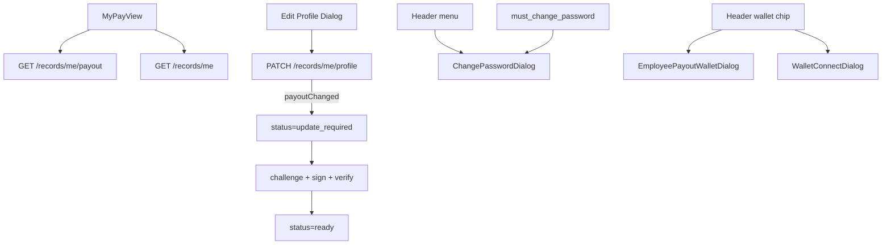

# 员工端 My Pay 重构

## 已确认决策

- Edit 字段限制**仅员工端**；管理员 Recipients Edit 仍为完整表单
- 头像本轮仍 toast「Photo upload coming soon」，不做 R2 / `avatar_url`
- Header 钱包弹窗无独立 Figma 帧：按现有 Decash 弹窗语言（圆角白底、Montserrat、主按钮）重做员工/管理员两端

## 现状与缺口

| 能力 | 现状 | 缺口 |
|---|---|---|
| `/my-pay` | [`MyPayView.tsx`](src/views/employee/MyPayView.tsx) 占位 + 强制改密 | 整页 UI |
| 员工资料 | `GET /records/me/payout` 字段过少（无 email/role/schedule/nextPayday/created_at） | 扩展响应 |
| 员工自改资料 | 仅有 `PUT /me/payout`（token/network/endpoint）+ `PATCH /auth/me`（仅 users.name） | 需自助更新 name/email + payout，并同步 `users` |
| 支付历史 | `GET /records/me` → 旧 `payrun_items` | 应对齐 Quick Pay 的 `employee_payments`（含 Tx / From / Status） |
| 改密入口 | 仅邀请后 `must_change_password` 强制弹窗 | Header 菜单两端加入口 |
| 钱包弹窗 | [`EmployeePayoutWalletDialog`](src/components/EmployeePayoutWalletDialog.tsx) / [`WalletConnectDialog`](src/components/WalletConnect.tsx) 旧样式 | 视觉对齐设计系统 |

**Schema**：改密 / 钱包重验 / name·email·payout 字段均已存在，**无需 migration**。

## 后端改动（有，但无表结构变更）

在 [`api/src/routes/records.ts`](api/src/routes/records.ts) + 文档 [`docs/api/records.md`](docs/api/records.md)：

1. **扩展 `GET /api/records/me/payout`**  
   返回完整员工侧展示字段：`id, name, email, role_title, employee_type, token, network, amount_minor, endpoint, status, payout_verified_at, last_paid_at, created_at, payment_cadence, payment_date_key, nextPayday, nextPaydayDisplay`  
   - schedule / nextPayday 复用 org 列表里已有逻辑（[`org.ts` enrich](api/src/routes/org.ts) 约 620–648 行）  
   - 额外聚合：`totalReceivedMinor`（`employee_payments` 中 `status=paid` 求和）、可用 `created_at` 算 Duration

2. **新增 `PATCH /api/records/me/profile`**（员工）  
   Body 可选：`name`, `email`, `token`, `network`, `endpoint`  
   - 写 `employees`；`name`/`email` 同步 `users`（email 做 org 内唯一校验）  
   - 若 token/network/endpoint 任一变化 → 现有规则：`status=update_required`, `payout_verified_at=NULL`  
   - 响应 `{ payout }`（扩展后的 shape）

3. **替换/增强 `GET /api/records/me`**  
   改为返回本人 `employee_payments`（对齐 admin [`GET /org/employees/:id/payments`](api/src/routes/org.ts)）：  
   `{ payments: [{ id, paid_at, amount_minor, token, network, status, txHash, explorerUrl, fromAddress }] }`  
   - `txHash`/`explorerUrl`：join confirmed `payment_attempts.deposit_tx_hash`  
   - `fromAddress`：join `payment_attempts.signer_id → users.wallet_address`（设计稿 From 列）  
   - 兼容：同步更新 [`src/lib/api.ts`](src/lib/api.ts) 的 `myRecords` 类型与方法名（可保留方法名、改返回类型）

前端 client / hooks：`api.myPayout`、`api.updateMyProfile`（新）、`api.myRecords`；新增 `src/hooks/use-employee-api.ts`（react-query）。

## 前端：My Pay 页面

替换 [`src/views/employee/MyPayView.tsx`](src/views/employee/MyPayView.tsx) 占位，结构按 Figma `89:15401`：

```
Hi! {firstName}
[StatCell ×4: Compensation | Next payday | Total Received | Duration]
[ProfileCard ~389px]  [PaymentHistoryTable flex-1]
ChangePasswordDialog（保留 must_change_password 强制打开）
EditProfileDialog（受限 Add Recipient）
```

建议目录：

- `src/views/employee/MyPayView.tsx` — 组装
- `src/views/employee/my-pay/components/MyPayStats.tsx` — 复用 [`StatCell`](src/components/stats/StatCell.tsx)
- `src/views/employee/my-pay/components/MyPayProfileCard.tsx` — 对齐 [`RecipientDetailCard`](src/views/admin/recipients/components/RecipientDetailCard.tsx) 样式；Verified 用 [`IconCheck`](src/components/icons/check.tsx)；Edit 用 [`IconPen`](src/components/icons/pen.tsx)
- `src/views/employee/my-pay/components/MyPayHistoryTable.tsx` — 列：Amount / Receive / From / Time / Stats(+Tx)；Success pill 用 `IconCheck`；文案用 **Success**（修正设计稿拼写）
- `src/views/employee/my-pay/config.ts` — 文案/常量
- `src/views/employee/my-pay/utils.ts` — duration、金额格式等（复用 recipients utils：`formatCompensation` / `roleBadgeAbbrev` / `isVerified` 等，可抽到共享或直接 import）

响应式：桌面左右栏；`< md` 上下堆叠；统计条可横向滚动或 2×2。

## 前端：Edit 弹窗（复用 Add Recipient）

改造 [`AddRecipientDialog`](src/views/admin/recipients/components/AddRecipientDialog.tsx)：

- 新增 `variant?: "admin" | "self"`（默认 `"admin"`）
- `variant="self"` + `mode="edit"`：
  - 仅渲染：头像（coming soon）、Name、Email、Received Token&Network、Wallet Address
  - 标题 `Edit Profile`；主按钮 **Save**
  - 提交走 `PATCH /records/me/profile`（非 admin `updateEmployee`）
  - Wallet/token/network 变更后嵌入 **Ownership 重验**（复用 [`usePayoutOwnership`](src/hooks/use-payout-ownership.ts) + 样式对齐后的 actions）；保存 payout 变更后引导 Verify（逻辑参考遗留 [`EmployeePayoutPage`](src/pages/employee/EmployeePages.tsx)）
- Admin `variant` 行为不变（完整字段；按钮仍可为 Update / Add Recipient）

`MyPayView`：`Edit` → 打开该弹窗 `variant="self"`。

## 前端：Header 改密 + 钱包弹窗

[`AppHeader.tsx`](src/components/layout/AppHeader.tsx)：

- `HeaderAccountMenu` 增加 **Change password**（admin / employee 共用），点击打开 `ChangePasswordDialog`
- 对话框状态放在 Header（或 `AppLayout`），与 `MyPayView` 的强制改密并存：
  - `must_change_password` 仍在 `MyPayView` 自动 `open=true` 且不可关闭（现有逻辑保留）
  - 菜单入口仅在 `must_change_password === false` 时可用，或打开同一对话框但强制模式仍由 flag 控制

重做样式：

- [`EmployeePayoutWalletDialog`](src/components/EmployeePayoutWalletDialog.tsx)
- [`WalletConnectDialog`](src/components/WalletConnect.tsx)

对齐 Decash：`rounded-[24px]`、Montserrat、去掉偏 shadcn/lucide 重图标头（或弱化）、主 CTA 黑/品牌绿；**保留** challenge → sign → verify / unbind 全部业务逻辑与 RainbowKit dismiss 防护。

Ownership 操作区（弹窗内与 Edit 内）同步轻量改版，Verified/Success 对勾统一 `IconCheck`。

## 数据流



## 文档

- 更新 [`docs/api/records.md`](docs/api/records.md)、[`docs/api.md`](docs/api.md) 索引
- [`docs/architecture.md`](docs/architecture.md) / [`docs/page-migration-guide.md`](docs/page-migration-guide.md)：标注 My Pay 已落地、员工自助 profile/history 端点

## 验收要点

- 员工登录见 Figma 布局与关键数据
- Edit 仅 5 类字段，Save 生效；改钱包后需重新 Verify 才变 Ready
- 邀请进线仍强制改密；菜单可主动改密（管理员同入口）
- Header 两端钱包弹窗视觉一致且功能不回归
- `pnpm run check` 通过；无中文源码/UI 文案
